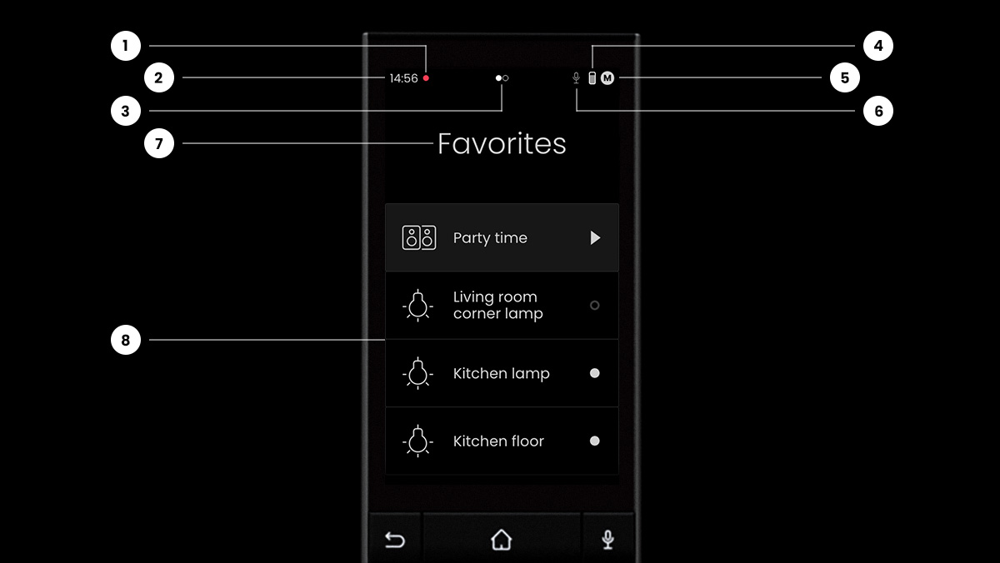
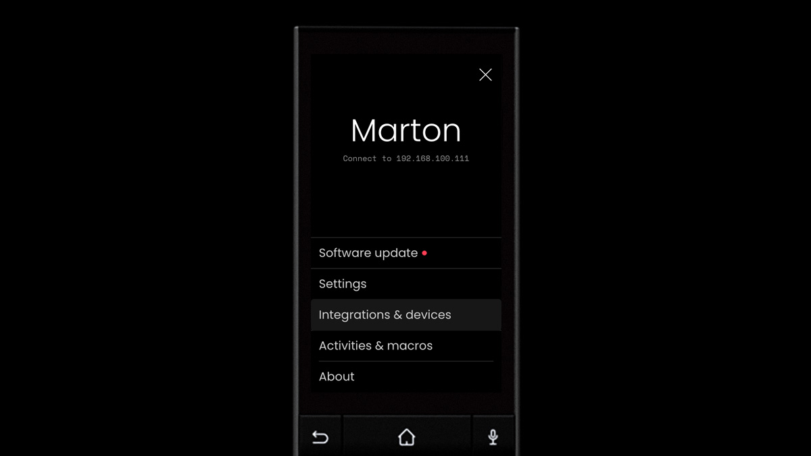
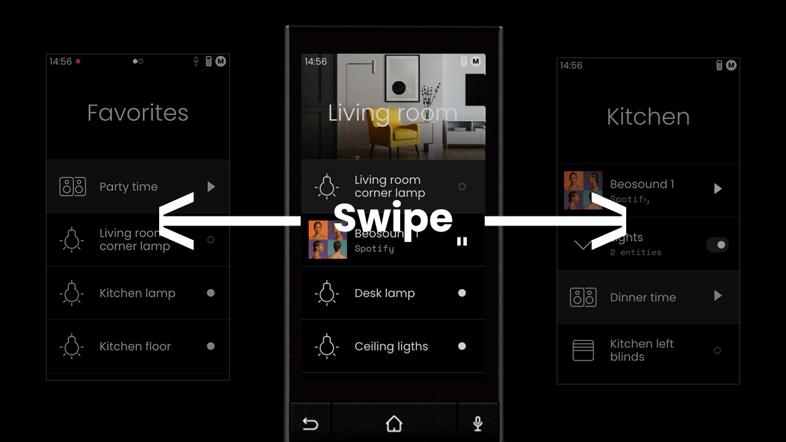
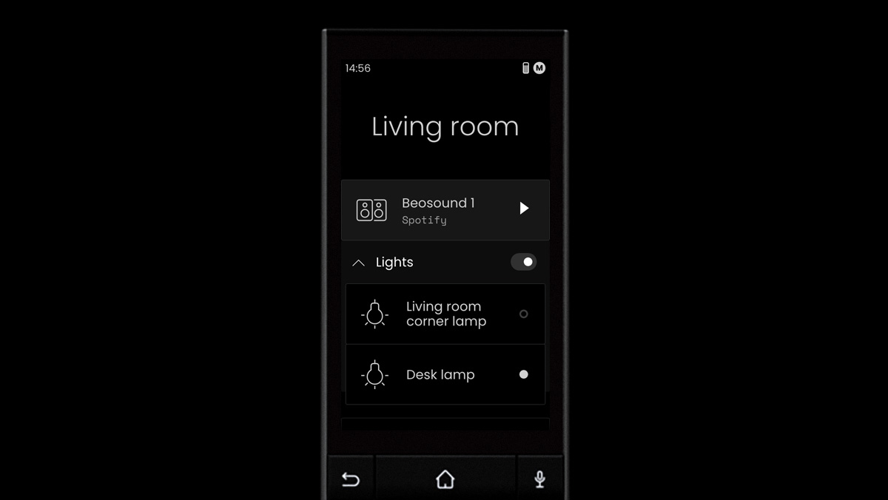

# Remote Two User Interface

The user interface was designed to be easy to use by anyone, who can use a smarthome app. Similar principles were applied to the touch interface, enhanced with button navigation and control.

## Home/page screen

|     | Description                                 |
| --- | ------------------------------------------- |
| 1   | Notification indicator                      |
| 2   | Clock                                       |
| 3   | Indicator when an integration is connecting |
| 4   | Battery level                               |
| 5   | Current profile - tap opens setting         |
| 6   | Microphone in use indidcator                |
| 7   | Current page - tap opens page selector      |
| 8   | List of entities/groups                     |

## Profiles

A profile can contain customised settings and UI configurations, including pages, groups and entities.

A profile can be changed by tapping on the current profile in settings.

## Pages

A page can contain entities or groups. Pages can be selected by swiping left and right or using the left and right buttons on the D-pad. Tapping the page's name will bring up the page selector, where pages can be also added, deleted or renamed. Pages can have an image header and contain entities or groups. Multiple pages can contain the same entity.

A page can be used to segment rooms, areas, a specific purpose or anything else that makes sense to you.

## Groups

Groups are a set of entities that can be defined by the user. Groups are another way of organising entities. A group can be configured to have a group switch, that can turn on/off every entity within the group at once. A group can be collapsed or expanded.

Example of a group containing two lights in expanded mode.
